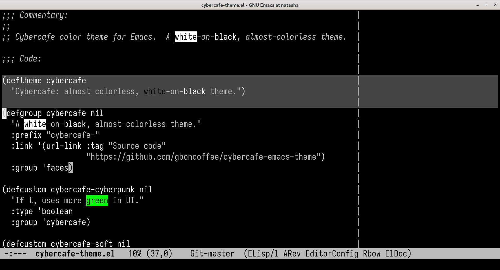
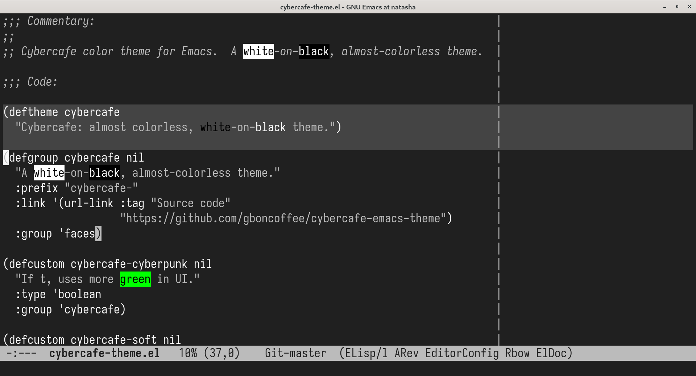
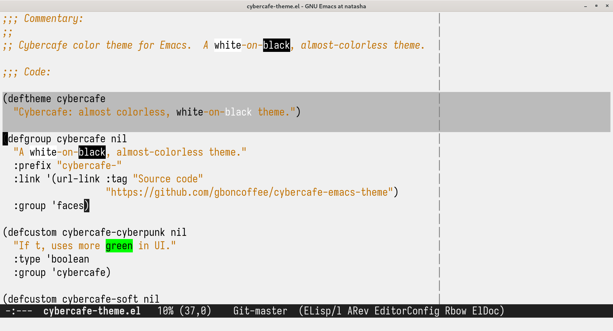

# Cyber Cafe Theme for Emacs

Cyber Cafe is an almost colorless, white-on-black theme. Created for
distraction-less programming, knowing that syntax highlight is overrated.

Install it from melpa: `cybercafe-theme`.

## Customizing

Currently there's three customizable options: if you set the variable
`cybercafe-cyberpunk` to non-nil before applying the theme, more green will be
used to UI components. If you set `cybercafe-soft`, a slighter lighter
background will be used. And if you set `cybercafe-light`, the light variant is
used.

## Compatibility

I've only added special support for stuff I use. Feel free to contribute support
for other modes. Most should work just with the `font-lock` support tho.

- Magit  
- Ido  
- Dired  
- Org  
- Markdown  
- Tuareg  
- Doom Modeline  
